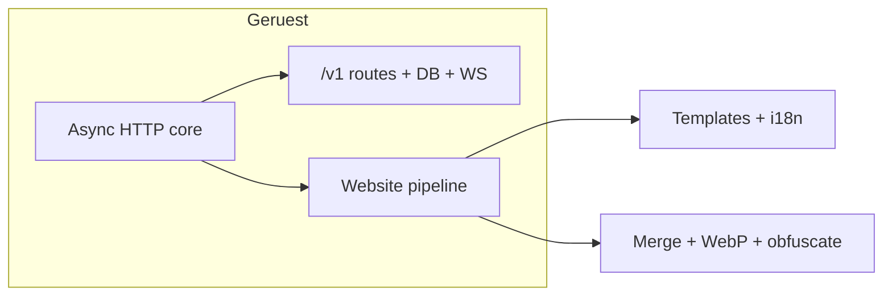
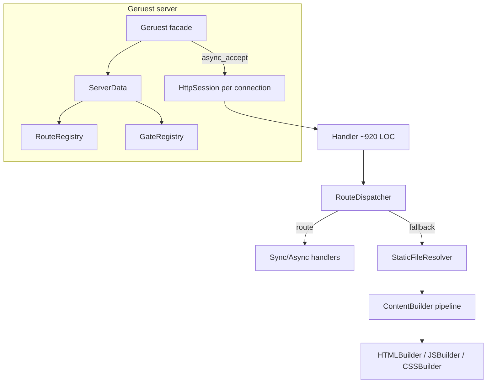

# Geruest Project Review

**Date:** June 2025  
**Framework version:** 0.12.7 (CMake)  
**Scope:** Full codebase review from four independent read-only analyses (architecture, developer experience, feature scope, code quality & tests).

---

## Executive Summary

Geruest is **not** a static site generator and **not** raw Boost.Beast. It is a **runtime async C++ web server** with an integrated, on-demand **website pipeline** (templates, i18n, asset merge, optional WebP/obfuscation) plus first-class **`/v1` async routes**, gates, DB, WebSockets, and ops metrics.

The **HTTP core is sound**: accept → session → handler → dispatcher → static files is clear, tested in parts, and performant where it matters (`sendfile`, coroutines, path safety). The main risks are **scope creep** (~2.4k lines of custom JS obfuscation), **documentation drift**, **API footguns**, and a few **real bugs** (text cache staleness, dead config).

**Sweet spot for adopters:** `addRoot`, `addRoute`, `loadConfig`, dev mode, templates/i18n, gates — with merge/obfuscation/WebP/email **off** until explicitly needed.

---

## What Geruest Is

| Question | Answer |
|----------|--------|
| Web server? | **Yes** — primary identity |
| Static site generator? | **No** — no batch export; lazy on-request transform + optional disk cache |
| Coherent feature set? | **Mostly yes** for monolithic C++ apps: multi-lang static frontend from `website/` + `/v1` REST |

**What makes Geruest special vs Boost.Beast + hand-rolled code:**

| Beast + hand-rolled | Geruest adds |
|---------------------|--------------|
| TCP accept + HTTP parse yourself | `HttpSession.cpp`, `Handler.cpp`, keep-alive, sendfile |
| Manual route table | `RouteRegistry.cpp` — exact + wildcard, sync/async/WS |
| Static files = `ifstream` | `StaticFileResolver.cpp` + `Security::isSafePath` |
| — | Template/i18n pipeline: `HTMLBuilder.cpp`, `LanguageConfig.cpp` |
| — | Per-page asset merge: `AssetMerger.cpp` |
| — | Built-in obfuscation cache: `JSBuilder.cpp`, `ObfuscationSettings.cpp` |
| — | Page/route gates: `GateRegistry.cpp`, `GateEvaluation.hpp` |
| — | Integrated async DB: `HTTPRequest::database()` + `DatabaseClient.cpp` |
| — | Token `/status` with persistence: `Status.cpp`, `ServerMetrics.cpp` |
| — | Convention-over-configuration `website/` layout |

**Tradeoff:** Batteries included for a specific frontend layout, but you inherit ~2.4k lines of custom JS tooling and opinionated URL semantics that Beast would never impose.

---

## Architecture Snapshot

**Request path:** `Socket.cpp::doAccept` → `HttpSession` (strand + `co_spawn`) → `Handler::runAsync` (HTTP framing) → `RouteDispatcher::dispatchAsync` (redirect → sync route → async route → static file) → `sendFileAsync` / socket write.

**Separation wins already landed:** `RouteRegistry`, `GateRegistry`, `StaticFileResolver`, `RouteDispatcher`, `GateEvaluation.hpp`, split `server/{Config,Socket,Workers,Status}.cpp`.

**Coupling hotspots:** `Handler.cpp` (~920 lines), `Geruest.hpp` (~768 lines public API), `ServerData` as config + routing + metrics + auth + asset flags, `HttpSession` reaching `server_.serverData` directly.

---

## What's Good (Consensus)

| Area | Why it works |
|------|----------------|
| **Request pipeline** | WebSocket → redirects → sync routes → async routes → static files (`Handler.cpp`, `RouteDispatcher.cpp`) |
| **Registry split** | `RouteRegistry`, `GateRegistry`, `StaticFileResolver`, `GateEvaluation.hpp` — real separation vs one giant map |
| **Static + security** | `Security::isSafePath` + resolver checks; Linux `sendfile`; body/header limits (64 KiB headers, 16 MiB body) |
| **Gates model** | Page gates (302) vs route gates (403); merged assets inherit page access |
| **Async first-class** | Coroutines for routes, DB (`DatabaseClient`), WebSockets (~750 LOC, tested) |
| **Optional backends** | CMake flags for Postgres/SQLite/CURL/WebP — core stays lean |
| **DB layer** | Parameter binding, not string concat (preferred over `Security::buildQuery`) |
| **Documentation hub** | `doc/README.md`, gated routes, config, asset merging, dev mode, security |
| **Ops depth** | `/status` with latency percentiles, cgroup metrics, persistence |
| **Website conventions** | `{components/...}`, `[translations/...]`, HTML-driven asset merge |
| **Test coverage (partial)** | 20+ GTest binaries: gates, WebSocket, security, obfuscator, DB, resolver |
| **Example app** | `exemples/showcase/showcase.cpp` exercises routes, WS, email, gates; `exemples/minimal/minimal.cpp` for first hour |
| **HTTP robustness** | Keep-alive, pipelining, chunked bodies, `100 Continue`, `method_not_allowed` pattern |
| **Compiler warnings** | `-Wall -Wextra -Wpedantic -Wconversion -Wshadow` in `CMakeLists.txt` |
| **Memory management** | Largely avoids raw owning pointers; mutex-protected caches |

---

## What's Bad (Consensus)

### Documentation & Marketing Drift

*Addressed in doc pass (June 2025): version/C++20, `EmailSender`, HTML-driven asset merge, config priority, removed unimplemented security/CLI claims.*

| Claim | Reality |
|-------|---------|
| v0.7.8, C++17 | **0.12.7, C++20** (`CMakeLists.txt`) |
| `files_maps/*.json` | **Not used**; HTML scan in `AssetMerger.cpp` |
| `EmailService` | Class is **`EmailSender`** |
| Rate limiting, IP blocking, CLI, logic bomb | **Not implemented** (email IP limits only) |
| “Single header” | `#include <Geruest.hpp>` pulls Boost, DB, JSON, WebSocket; many helpers need extra includes |
| Config priority | **Code > .env > env** for `loadConfig()`; standalone `ConfigLoader::get*()` is `.env > env > default` |

### Real Bugs / Footguns

- **`TextResponseCache`** stores `mtime` on write but **never checks it on lookup** → stale HTML/CSS/JS after disk edits (`TextResponseCache.cpp`)
- **Global cache singleton** — two `Geruest` instances share cache keys
- **`hostname_` / `HOSTNAME`** set but **`init()` binds `tcp::v4()` only** — misleading (`Socket.cpp`)
- **Sync + async on same path** — sync wins silently; async registration ignored
- **`sendfile` failure after headers** — truncated response possible
- **`getParam()`** merges query + JSON body + cookies — **undocumented** in `DATA_CLASSES.md`; JSON only top-level strings
- **`responseOK()` defaults to `text/plain`** — easy wrong MIME for JSON APIs
- **`init()` calls `exit()`** on bind failure — harsh for library use

### Architecture Smells

- **`Handler.cpp` (~920 LOC)** — HTTP framing, metrics, WebSocket, gates, cache, WebP, 404 pipeline
- **`Geruest.hpp` (~768 LOC)** — configuration megaclass
- **`ServerData`** — config + routing + metrics + auth + asset flags in one blob
- Dead members: `clientCount`, `idling`, `requestStream`, unused `TIMEOUT_SEC`
- **`ServerData` copy ctor** omits `_metrics` and `_devAssetCache`

### Security Gaps (Pragmatic)

- **BasicAuth:** unsalted SHA-256, `==` compare, no mutex on runtime user changes
- **CORS:** reflects any `Origin`; no OPTIONS preflight handler
- **Referer-based image paths** in `StaticFileResolver` — spoofable
- **WebSocket upgrade** — no `Origin` validation
- **Custom JSONParser** — fragile for large/nested `/v1` payloads

---

## What Could Be Done Better

### Core HTTP (Keep Philosophy, Reduce Pain)

1. Finish **Handler decomposition** — extract HTTP framing + response writer; keep `RouteDispatcher` / `StaticFileResolver`
2. **Mtime-aware text cache** + per-server cache on `ServerData`
3. ~~**Unify route API** — one `addRoute` accepting sync or async; collapse gated-route overloads over time~~ (done)
4. **Bind address** — honor `hostname_` or add `setBindAddress()`
5. **`init()` returns bool/`expected`** instead of `exit()`
6. **CORS + OPTIONS** — `enableCors({origins, paths})` or minimal middleware

### Developer Experience

7. **`minimal.cpp` example** (~40 lines) in `exemples/minimal/` — separate from `exemples/showcase/showcase.cpp`
8. Split **`getQueryParam` / `getJsonField` / `getCookie`**; add **`responseJson()`**
9. Public **`geruest::logInfo`** instead of private `sendToLogger`
10. **`geruest/all.hpp`** re-exporting Security, Version, MethodNotAllowed
11. **Adoption checklist** in `GETTING_STARTED.md`
12. Align **version + C++20** everywhere (README, skill, AI instructions)

### Production Hardening

13. Document BasicAuth as **dev/admin-only, always behind TLS proxy**
14. DB parameter binding promoted; **`Security::buildQuery` de-emphasized**
15. **Integrate unit tests into root CMake + CI** (no `.github/workflows` today)
16. Handler-level integration tests (body limits, gates, cache, 503 overload)

### Asset Pipeline (Honest Defaults)

17. Default: **merge off, obfuscation 0, WebP off** — example should match
18. Document: “use esbuild/vite for serious JS; Geruest merge is for small sites without a JS toolchain”
19. Long-term: **optionalize or drop in-tree obfuscator** (levels 2–3); minify-only or external tool

---

## What Could Be Removed

| Item | Evidence |
|------|----------|
| **`files_maps` docs** | Superseded by HTML scan; tests only |
| **README logic bomb / false security claims** | No implementation |
| **Windows/MinGW in example readmes** | Removed per main README |
| **`TIMEOUT_SEC` macros** | Unused |
| **Handler dead members** | `clientCount`, `idling`, `requestStream` |
| **Legacy `build*Header()` in `HTTPResponse.hpp`** | `[[maybe_unused]]` |
| **`getJSONFromFile()` raw pointer API** | Use safe/unique_ptr variant |
| **Acorn `popen` validation in prod builds** | Node + `/tmp/` footgun |
| **Stale `unitTests/README.md`** | Wrong layout/counts |
| **Level 3 obfuscation + dead-code injection** | Breaks valid JS; marginal benefit |

**Do not remove without demand:** gates, WebSocket, DB — tested and used in `exemples/showcase/`.

---

## Missing Features (Realistic for Static Frontend + `/v1` API)

| Gap | Priority |
|-----|----------|
| **HTTPS/TLS** | Acknowledged; proxy termination |
| **CORS + OPTIONS** | **High** — blocks cross-origin SPAs |
| **Session/cookie/JWT helpers** | Medium — gates exist, no session primitive |
| **Multipart / file upload** | Medium — common for `/v1` |
| **Global HTTP rate limiting** | Medium — README promises it |
| **Middleware / filter chain** | Medium — e.g. `server.use("/v1/*", fn)` |
| **Request body streaming** | Low — 16 MiB cap then full buffer |
| **Method-based routing** | Low — manual `getMethod()` or `method_not_allowed` |
| **Structured logging + request IDs** | Medium |
| **Project template / `geruest new`** | Medium — `exemples/minimal/` + heavy `exemples/showcase/` |
| **OpenAPI / route introspection** | Low |
| **Graceful config reload** | Low |
| **Offline “build website” CLI** | Low — pipeline is request-time |

Partially present: DB (compile flags), email (CURL), `method_not_allowed` (example only, not in main docs).

---

## Overkill Features

| Feature | ~Size / Cost | Verdict |
|---------|--------------|---------|
| **Custom JS obfuscator (levels 1–3)** | ~2437 LOC | Highest maintenance risk; security theater for client JS |
| **WebP in server** | stb + libwebp | Better as build step or CDN |
| **`/status` cgroup depth** | `Status.cpp` | Excellent for Docker; overkill for hello-world |
| **Custom JSONParser** | ~1000+ LOC | Reinvents solved problem |
| **Email subsystem** | queue + workers + heuristics | Full product inside framework |
| **Postgres libpq pipelining** | `DatabaseClient.cpp` | Great engineering; overkill for SQLite-only sites |
| **8 gate registration overloads** | `Geruest.hpp` | Power-user; document one pattern |
| **Referer-based image routing** | `StaticFileResolver` | Clever, hard to reason about |
| **Dual WebSocket APIs** | coroutine + callback | Pick one idiomatic style |

---

## Useless / Low-Value Features

- **`files_maps` JSON workflow** — documented, never implemented in builders
- **Logic bomb, CLI, global rate limit** — README only
- **Obfuscation level 3** — breaks `for...of`, JSON shorthand, globals (skill documents workarounds)
- **Half-baked CORS on helpers only** — inconsistent, not a real CORS story
- **Saving `html/{lang}/` to disk on first request** — confusing hybrid cache vs SSG vs dynamic
- **Many obscure HTTP status helpers** (203, 205, …) — rarely used
- **`hostname_` config** — stored, never applied
- **`FileManagement::createFile`** — confusing naming/docs

---

## Feature Matrix: Documented vs Implemented

| Feature | Documented | Implemented | Notes |
|---------|------------|-------------|-------|
| Routing sync/async/WS | Yes | Yes | `Geruest.hpp`, `RouteRegistry.cpp` |
| Static files | Yes | Yes | `StaticFileResolver.cpp`, `Handler::sendFileAsync` |
| Templates `{file}` | Yes | Yes | `HTMLBuilder.cpp` |
| Translations | Yes | Yes | Runtime + optional disk cache to `html/{lang}/` |
| Asset merge | Yes | Yes | HTML scan in `AssetMerger.cpp` |
| JS obfuscation | Yes | Yes | Large; dev mode disables |
| WebP | Yes | Yes | Optional `GERUEST_HAS_WEBP` |
| i18n URL prefixes | Yes | Yes | 2-letter langs only (`LanguageConfig.cpp`) |
| BasicAuth | Yes | Yes | Global + protected pages; SHA-256 no salt |
| Gates | Yes | Yes | `GateRegistry.cpp` |
| Email | Yes (wrong class name) | Yes if CURL | `EmailSender.cpp` |
| JSON | Yes | Yes | Custom `JSONParser` |
| Config `.env` | Yes | Yes | `ConfigLoader.cpp`, `server/Config.cpp` |
| Database PG/SQLite | Yes | Yes (optional build) | `database/` |
| Redirects | Yes | Yes | `RouteRegistry.cpp` |
| Custom 404 | Yes | Yes | `Handler::sendNotFoundResponseAsync` |
| Dev mode | Yes | Yes | `ServerData::enableDevMode` |
| Metrics `/status` | Partially in FEATURES | Yes | `enableStatus()` in `Status.cpp` |
| CORS | “Manual” | Partial auto | `HTTPResponse.cpp` `addDefaultHeaders` only |
| Rate limiting | README (fixed) | No (email only) | — |
| CLI | README (fixed) | No | — |

---

## Top 10 Recommendations (Priority Order)

1. **Fix doc/code alignment** — Done: `files_maps`, class names, version/C++20, honest README security list, unified config priority docs.

2. **Fix `TextResponseCache` invalidation** — Compare mtime on lookup; scope cache per `ServerData`. One bug fix, big production trust.

3. **Add minimal CORS + OPTIONS for `/v1/*`** — Highest-impact missing piece for browser `fetch` to API.

4. **Stabilize the “first hour” path** — `exemples/minimal/minimal.cpp`, adoption checklist in `GETTING_STARTED.md`, split `exemples/`, sane defaults (merge off, obfuscation 0).

5. **Fix HTTP DX footguns** — Document/split `getParam()` behavior; add `responseJson()`, public `getCookie()`; document `method_not_allowed`.

6. **Finish Handler decomposition** — Extract HTTP framing; keep async model, shrink blast radius of ~920-line file.

7. **Demote or optionalize JS obfuscator** — CMake flag; minify-only default; long-term consider external bundler only.

8. **Split “core server” vs “website kit”** in docs/CMake — API-only adopters should know what they pull in.

9. **Integrate tests + CI** — Root `add_subdirectory(unitTests)`, Handler integration tests, default SQLite tests.

10. **Harden trust boundaries** — BasicAuth as dev-only or bcrypt+constant-time; CORS allowlist; WebSocket Origin check; drop return or guard Referer image logic.

---

## Quick Reference by Lens

| Lens | Verdict |
|------|---------|
| **Architecture** | Sound async core; Handler/Geruest bloat; finish decomposition |
| **Developer experience** | Strong docs hub; API footguns (`getParam`, MIME defaults); heavy example |
| **Feature scope** | Coherent for one niche; obfuscator + stale docs are main coherence risks |
| **Code quality** | Solid security at boundaries; cache bug, weak auth, thin Handler test coverage |
| **Testing** | Strong on parsers/gates; weak on HTTP server core; not in root CMake/CI |
| **Performance** | sendfile, thread-local caches; bottlenecks: wildcard O(n), WebP lock, full-string pipeline |
| **Security** | Path traversal and DB binding solid; BasicAuth, CORS, referer logic are practical gaps |

---

## Bottom Line

Geruest’s differentiated value is **convention-based C++ website hosting with a request-time asset pipeline and first-class async `/v1` routes** — not raw HTTP performance vs Beast.

The core scaffold **already holds weight**. The highest-leverage moves are boring: **fix the text cache**, **stop lying in docs**, **add CORS/OPTIONS**, **trim API footguns**, and **resist growing the obfuscator/WebP/email surface** until sync/async routes and the adoption path are foolproof.

For a small/medium **website + REST API**, use: `addRoot`, `addRoute`, `loadConfig`, `enableDevMode`, translations/components, gated pages/routes via `addGatedPage` / `addRoute(..., gate)` — and **leave obfuscation/WebP/email off** until explicitly needed.

**Practical floor:** C++20 (coroutines and Boost.Asio are central), not C++17.
